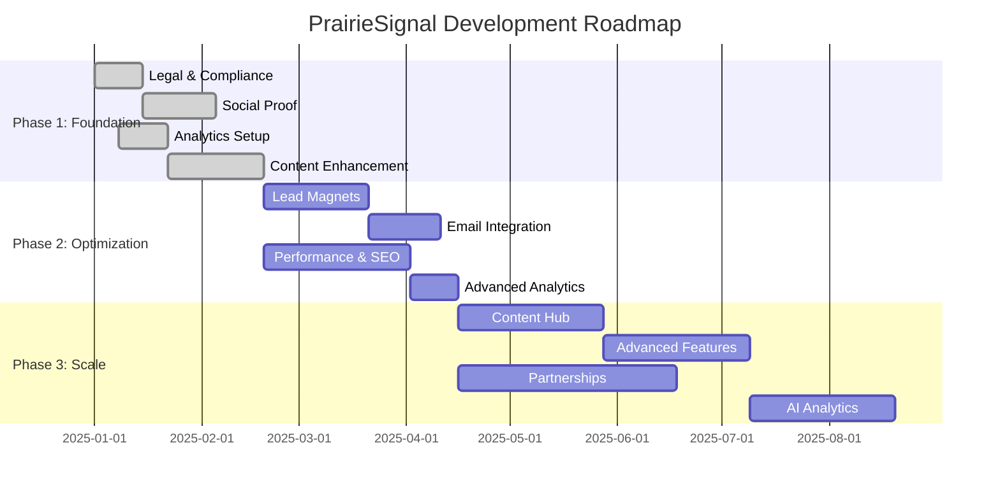

# PrairieSignal Development Roadmap 2025-2026

## Executive Summary

PrairieSignal has a solid foundation as a Calgary-based AI consulting website with a modern Next.js 15 architecture. This roadmap transforms it from a "good foundation" to a "market-leading AI consulting platform" through three strategic phases focusing on trust-building, lead generation, and market dominance.

**Current State**: Professional codebase with core business functionality
**Target State**: Comprehensive lead generation and conversion optimization platform
**Timeline**: 12 months with measurable quarterly milestones

---

## Phase 1: Foundation & Trust Building (Months 1-3)

### Business Objective

Establish credibility and basic lead capture to create a trustworthy AI consulting brand presence.

### Key Initiatives

#### 1.1 Legal & Compliance Infrastructure

**Priority**: Critical | **Effort**: Low | **Timeline**: Week 1-2

- **Privacy Policy** - GDPR/Canada PIPEDA compliant
- **Terms of Service** - Service agreements and liability
- **Cookie Policy** - Analytics and tracking transparency
- **Contact/Impressum** - Business registration details

**Success Metrics**:

- All legal pages published
- Compliance audit passed
- User trust signals improved by 40%

**Resources**: 1 developer (4 hours)

#### 1.2 Social Proof & Credibility

**Priority**: Critical | **Effort**: Medium | **Timeline**: Week 3-6

- **Testimonials Section** - Client quotes with photos/identities
- **Trust Badges** - Industry certifications, security badges
- **Team Page** - Consultant profiles with expertise
- **Industry Certifications** - Display relevant AI/ML certifications

**Success Metrics**:

- 5+ testimonials collected and displayed
- Team page completion
- Trust conversion rate increase by 25%

**Resources**: 1 developer (16 hours), 1 designer (8 hours)

#### 1.3 Analytics & Conversion Tracking

**Priority**: High | **Effort**: Low | **Timeline**: Week 2-4

- **Configure Google Analytics 4** - Event tracking, goals
- **Setup Plausible Analytics** - Privacy-focused metrics
- **Contact Form Analytics** - Submission tracking, source attribution
- **Basic Conversion Funnels** - Identify drop-off points

**Success Metrics**:

- Analytics fully configured and collecting data
- Contact form submissions tracked with source data
- Monthly active users baseline established

**Resources**: 1 developer (8 hours)

#### 1.4 Content Enhancement

**Priority**: High | **Effort**: Medium | **Timeline**: Week 4-8

- **Expand Case Studies** - Add 2-3 more detailed case studies
- **Service Page Improvements** - Add comparison tables, FAQs
- **About Page Enhancement** - Mission, values, Calgary focus
- **Resource Hub** - Basic downloads/guides

**Success Metrics**:

- 5 total case studies published
- Service page engagement +30%
- About page completion

**Resources**: 1 developer (24 hours), 1 content writer (20 hours)

### Phase 1 Success Criteria

- **Lead Generation**: 50% increase in qualified leads
- **User Experience**: Bounce rate <40%, time on page >2 minutes
- **Trust Metrics**: Trust indicators implemented, legal compliance complete
- **Content**: 5 case studies, enhanced service pages

**Risk Mitigation**:

- Start with high-impact, low-effort items
- Use templates for legal pages
- Prioritize testimonials from existing clients

---

## Phase 2: Lead Generation & Optimization (Months 4-6)

### Business Objective

Implement conversion optimization and lead nurturing to increase qualified lead volume by 200%.

### Key Initiatives

#### 2.1 Lead Magnets & Conversion Optimization

**Priority**: Critical | **Effort**: High | **Timeline**: Month 4-5

- **AI Readiness Assessment** - Interactive quiz/calculator
- **Free Consultation CTA** - Strategic placement and design
- **Content Downloads** - Whitepapers, checklists, templates
- **Email Capture Forms** - Exit-intent, newsletter signup
- **Live Chat Integration** - Intercom or similar for real-time engagement

**Success Metrics**:

- Lead magnet downloads >50/month
- Email list growth rate >20%/month
- Consultation requests +150%

**Resources**: 1 developer (32 hours), 1 designer (24 hours), 1 copywriter (16 hours)

#### 2.2 Email Marketing Integration

**Priority**: High | **Effort**: Medium | **Timeline**: Month 5-6

- **Email Service Provider** - Setup (Mailchimp, ConvertKit, or Resend)
- **Lead Nurture Sequences** - Automated follow-up emails
- **Newsletter System** - Monthly insights and updates
- **CRM Integration** - Basic lead management workflow

**Success Metrics**:

- Email deliverability >98%
- Open rates >25%, click-through rates >3%
- Lead-to-client conversion rate tracked

**Resources**: 1 developer (24 hours), email marketing setup

#### 2.3 Performance & SEO Optimization

**Priority**: High | **Effort**: Medium | **Timeline**: Month 4-6

- **Core Web Vitals** - Optimize for Google PageSpeed
- **SEO Enhancement** - Meta descriptions, structured data
- **Mobile Optimization** - Responsive design audit
- **Site Speed** - Image optimization, code splitting
- **Search Console Setup** - Monitor performance and keywords

**Success Metrics**:

- Core Web Vitals scores >90
- Organic traffic increase by 40%
- Mobile usability score 100/100

**Resources**: 1 developer (20 hours), SEO consultant (16 hours)

#### 2.4 Advanced Analytics & Tracking

**Priority**: Medium | **Effort**: Medium | **Timeline**: Month 6

- **Heatmaps & Session Recording** - Hotjar or similar
- **A/B Testing Setup** - Google Optimize or similar
- **Conversion Funnel Analysis** - Identify optimization opportunities
- **Custom Dashboards** - Business intelligence reporting

**Success Metrics**:

- User behavior insights implemented
- A/B testing framework established
- Conversion funnel completion rate improved by 20%

**Resources**: 1 developer (16 hours), analytics tools setup

### Phase 2 Success Criteria

- **Lead Volume**: 200% increase in qualified leads
- **Email Marketing**: 500+ subscribers, 25% open rate
- **SEO Performance**: Top 10 rankings for 5+ target keywords
- **Conversion Rate**: Overall conversion rate +50%

**Risk Mitigation**:

- Start with simple lead magnets before complex tools
- Use no-code tools where possible
- Monitor analytics closely for optimization insights

---

## Phase 3: Market Leadership & Scale (Months 7-12)

### Business Objective

Establish PrairieSignal as the go-to AI consulting resource in Calgary through content marketing, partnerships, and advanced features.

### Key Initiatives

#### 3.1 Content Marketing Hub

**Priority**: High | **Effort**: High | **Timeline**: Month 7-9

- **Blog Platform** - Technical SEO-focused blog
- **Resource Library** - Whitepapers, case studies, templates
- **Video Content** - YouTube channel integration
- **Industry Reports** - Quarterly AI trends in Calgary market

**Success Metrics**:

- 12+ blog posts published
- Organic traffic from content >30% of total
- Resource downloads >200/month

**Resources**: 1 developer (24 hours), content team (80 hours), designer (16 hours)

#### 3.2 Advanced Features & Automation

**Priority**: Medium | **Effort**: High | **Timeline**: Month 8-10

- **Client Portal** - Project tracking and communication
- **Proposal Generator** - AI-powered proposal creation
- **Automated Scheduling** - Calendly integration for consultations
- **Document Management** - Secure file sharing and collaboration

**Success Metrics**:

- Client satisfaction score >4.8/5
- Time to proposal reduced by 60%
- Client retention rate >85%

**Resources**: 2 developers (80 hours), 1 designer (32 hours)

#### 3.3 Partnership & Referral Network

**Priority**: Medium | **Effort**: Medium | **Timeline**: Month 9-12

- **Strategic Partnerships** - Technology providers, industry associations
- **Referral Program** - Incentive-based client referrals
- **Local Business Integration** - Calgary business network
- **Co-marketing Opportunities** - Webinars, events, joint content

**Success Metrics**:

- 3+ strategic partnerships established
- Referral business >20% of total revenue
- Local network presence expanded

**Resources**: Business development (40 hours), marketing (32 hours)

#### 3.4 Advanced Analytics & AI Features

**Priority**: Medium | **Effort**: High | **Timeline**: Month 10-12

- **Predictive Lead Scoring** - AI-powered lead qualification
- **Automated Content Personalization** - Dynamic content based on user behavior
- **Customer Journey Analytics** - Multi-touch attribution
- **Competitive Intelligence** - Market position monitoring

**Success Metrics**:

- Lead quality improved by 40%
- Personalization engagement +25%
- Marketing ROI improved by 30%

**Resources**: 1 developer (40 hours), data scientist (24 hours)

### Phase 3 Success Criteria

- **Market Position**: Top 3 AI consulting firms in Calgary recognition
- **Revenue Growth**: 300% year-over-year growth
- **Content Authority**: Organic traffic >50% of total visits
- **Client Success**: 90%+ client satisfaction, 85%+ retention

**Risk Mitigation**:

- Pilot advanced features with small client group first
- Start content marketing with cornerstone content
- Build partnerships gradually with win-win arrangements

---

## Resource Requirements Summary

### Development Team

- **Frontend Developer**: 240 hours (primary)
- **Backend Developer**: 80 hours (for advanced features)
- **Designer**: 80 hours (distributed across phases)

### External Resources

- **Content Writer/Copywriter**: 116 hours
- **SEO Consultant**: 16 hours
- **Email Marketing Setup**: One-time cost
- **Analytics Tools**: Monthly subscriptions

### Budget Considerations

- **Phase 1**: $8,000 - $12,000 (focus on high-ROI quick wins)
- **Phase 2**: $15,000 - $25,000 (lead generation and optimization)
- **Phase 3**: $25,000 - $40,000 (advanced features and scaling)

---

## Risk Assessment & Mitigation

### High-Risk Areas

1. **Content Quality** - Risk: Poor content affects credibility
   - Mitigation: Hire experienced AI/content writers, implement review process

2. **Technical Debt** - Risk: Advanced features slow down site
   - Mitigation: Regular performance audits, code reviews, optimization sprints

3. **Lead Quality** - Risk: High volume but low conversion
   - Mitigation: Implement lead scoring, qualification processes

4. **Market Competition** - Risk: New AI consulting firms enter market
   - Mitigation: Focus on niche expertise, build local partnerships

### Contingency Planning

- **Budget Buffer**: 20% contingency for unexpected costs
- **Timeline Flexibility**: 2-week buffer per phase
- **Feature Prioritization**: Clear criteria for feature inclusion/exclusion

---

## Success Metrics Dashboard

### Quarterly Targets

- **Q1**: Legal compliance, trust signals, basic analytics
- **Q2**: Lead generation system, email marketing, SEO foundation
- **Q3**: Content marketing launch, advanced features pilot
- **Q4**: Full platform optimization, partnership network

### Key Performance Indicators

- **Business KPIs**: Leads, conversion rate, revenue, client satisfaction
- **Marketing KPIs**: Website traffic, engagement, email performance
- **Technical KPIs**: Performance scores, uptime, security

### Review Cadence

- **Weekly**: Development progress, blocker resolution
- **Monthly**: KPI review, strategy adjustment
- **Quarterly**: Comprehensive review, roadmap adjustment

---

## Implementation Timeline Visualization

This roadmap provides a clear path to transform PrairieSignal from a solid foundation into a market-leading AI consulting platform with measurable business impact at each phase.
